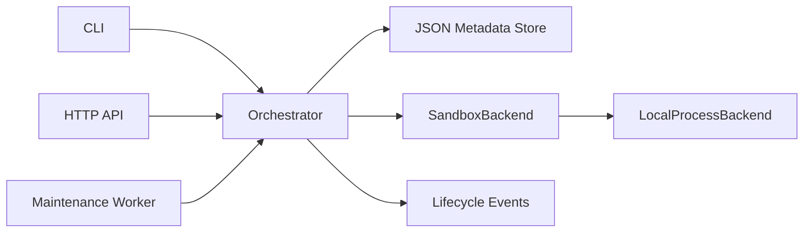
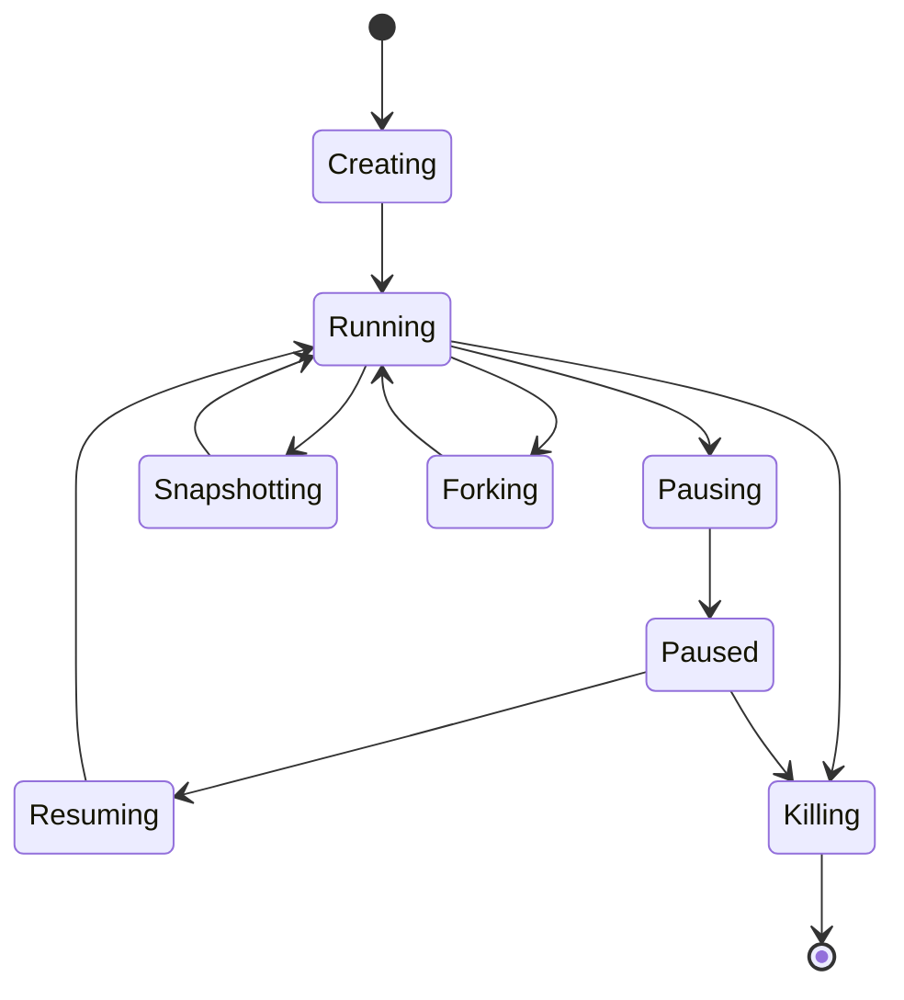

# Architecture

AgentENV Python 把参考项目最核心的生命周期拆为四层：

## 核心职责

- `Orchestrator`：验证请求、执行状态转换、回滚失败操作、生成审计事件；
- `SandboxBackend`：创建运行时、执行命令、捕获与恢复文件系统、销毁资源；
- `JsonMetadataStore`：原子写入模板、沙箱、快照和事件元数据；
- `MaintenanceWorker`：周期性检查 TTL，删除到期沙箱；
- CLI/API：仅负责输入输出，不直接操作工作目录。

## 生命周期

转换失败时，编排器会回滚到操作前状态并写入 `operation_failed` 事件。服务
重启后会协调遗留的过渡状态：工作目录仍存在的操作恢复为 `running`，无法
恢复或已经进入 `killing` 的记录则被移除。

## 当前取舍

暂停和恢复在本机后端中是逻辑状态转换；每次 `exec` 都是一次独立子进程。
快照只复制工作目录，不捕获进程内存。这些边界保持简单，方便下一阶段在
不改变编排层和 API 的情况下接入 Docker 或 Firecracker。
