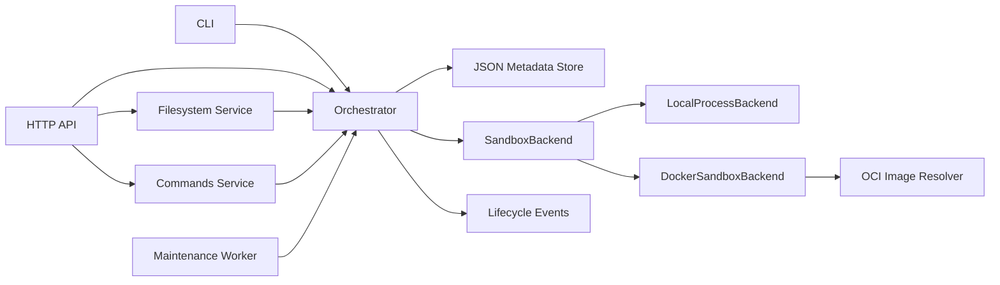
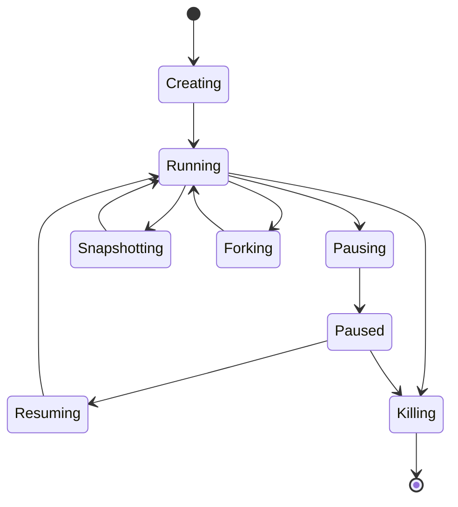

# Architecture

AgentENV Python 把参考项目最核心的生命周期拆为四层：

## 核心职责

- `Orchestrator`：验证请求、执行状态转换、回滚失败操作、生成审计事件；
- `SandboxBackend`：创建运行时、执行命令、捕获与恢复文件系统、销毁资源；
- `DockerSandboxBackend`：容器生命周期、资源限制和 Docker 网络连接；
- `OCI Image Resolver`：规范化 registry/repository/tag/digest 并检查镜像；
- `JsonMetadataStore`：原子写入模板、沙箱、快照和事件元数据；
- `MaintenanceWorker`：周期性检查 TTL，删除到期沙箱；
- `FilesystemService`：提供工作区路径隔离和 Local/Docker 统一文件操作；
- `CommandService`：管理后台进程、增量输出、stdin、信号和客户端重连；
- CLI/API：仅负责输入输出，不直接操作工作目录。

## 生命周期

转换失败时，编排器会回滚到操作前状态并写入 `operation_failed` 事件。服务
重启后会询问当前后端运行时是否仍然存在：存在的操作恢复为 `running`，
无法恢复或已经进入 `killing` 的记录则被移除。

## 当前取舍

本机后端的沙箱暂停和恢复是逻辑状态转换，但由 `CommandService` 启动的活动
进程组会真实收到 stop/continue；Docker 后端映射为容器 pause/unpause。两个
后端的快照都只复制工作目录，不捕获进程内存。Docker 的 allow/deny 列表在
编排层完整保存，但当前只有全量断网由后端强制执行。
